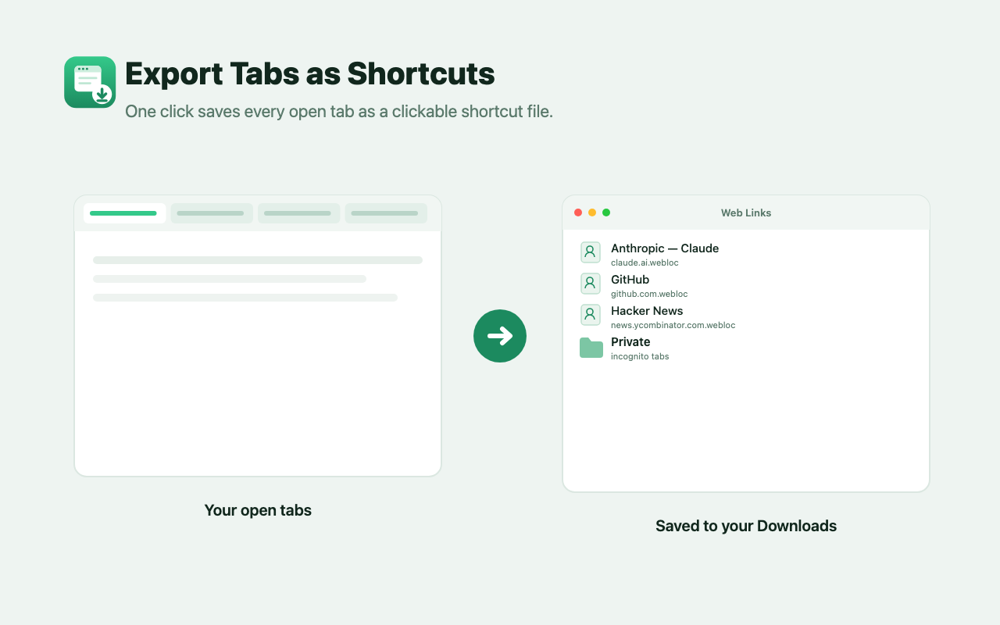

<p align="center">
  
</p>

<h1 align="center">Export Tabs as Shortcuts</h1>

<p align="center">
  One click saves every open tab as a clickable shortcut file —
  <code>.webloc</code> on macOS, <code>.url</code> on Windows &amp; Linux.
</p>

<p align="center">
  
</p>

A one-click Chrome/Edge extension (Manifest V3). Click the toolbar button and
every eligible tab in the current window is saved to your **Downloads** folder
under `Web Links/`, named after each page. Tabs from an incognito window are
routed into `Web Links/Private/`. Double-click any saved file to reopen that URL
in your default browser.

- **One click** — no popup, no setup; a badge shows how many tabs were exported.
- **Cross-platform** — `.webloc` on macOS, `.url` on Windows/Linux.
- **Incognito aware** — private-window tabs go into a separate `Private/` folder.
- **Private by design** — runs entirely on your device; no network requests, no
  tracking. See [PRIVACY.md](PRIVACY.md).

## Install (load unpacked)

1. Clone or download this repo:
   ```bash
   git clone https://github.com/bsc2fast/tab-export-extension.git
   ```
2. Open `chrome://extensions` (or `edge://extensions`).
3. Toggle **Developer mode** on (top-right).
4. Click **Load unpacked** and select the `tab-export-extension` folder.
5. The extension icon appears in the toolbar. Pin it if you like.

> To export from **incognito** windows, open the extension's **Details** page
> and enable **Allow in incognito**.

## Usage

Click the toolbar button. Every eligible tab in the current window is saved as a
shortcut file, and a green badge briefly shows how many were exported. Internal
pages (`chrome://`, `about:`, extension pages, etc.) are skipped.

## Permissions

| Permission  | Why it is needed                                              |
|-------------|--------------------------------------------------------------|
| `tabs`      | Read the title and URL of each open tab in the current window.|
| `downloads` | Save the generated `.webloc` / `.url` files to your computer. |

The extension makes no network requests and collects no data.

## Development

The runtime is just [`manifest.json`](manifest.json) and [`bg.js`](bg.js) — no
build step needed to load it unpacked. Two scripts (Node + headless Chrome on
macOS) regenerate the binary assets and package the store upload:

```bash
node tools/build-assets.mjs   # regenerate icons/ and store/ imagery from SVG
node tools/package.mjs         # build dist/tab-export-extension-v<version>.zip
```

- `tools/build-assets.mjs` — all icon and Chrome Web Store imagery is generated
  from inline SVG, so the visuals are reproducible and easy to tweak.
- `store/` — screenshots and promo tiles, plus [LISTING.md](store/LISTING.md)
  with ready-to-paste store-listing copy and permission justifications.

## Updating the extension

After editing the code, return to `chrome://extensions` and click the reload ↻
icon on the extension card — service-worker changes don't hot-reload.

## License

[MIT](LICENSE)
